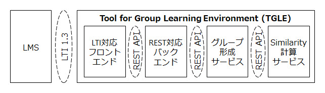

# TGLE

## 概要

TGLEは Tols for Group Learning Envoronmentの略で文字通りグループ学習の環境を支援するツールです。
次のモジュールから構成されています。
- Front-End: PHP + Vue
- Back-End: PHP + Laravel
- mkgroup: Python + Flask
- similarity: Python + Flask

TGLEはLTI 1.3ツールとして開発されており、Moodle等のLMSをPlatformとしてその機能を拡張します。

## GitHub構成

それぞれのモジュールは。次に示すように別々のリポジトリで管理され、gir submoduleにて関連付けられています。
- TGLE TOP: tgle
- Front-End: tgle-be
- Back-End: tgle-fe
- mkgroup: tgle-mkgroup
- similarity: tgle-similarity